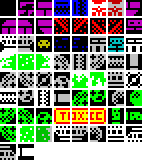

# mpagd_util

## Overview

`mpagd_util` is a utility tool designed to work with **Multi-Platform Arcade Game Designer (MPAGD)**, a game development tool created by [Jonathan Cauldwell](https://jonathan-cauldwell.itch.io/multi-platform-arcade-game-designer). MPAGD allows developers to create retro-style games for a variety of platforms, including ZX Spectrum, Amstrad CPC, MSX, and others.

This utility provides additional functionality to manage and manipulate MPAGD project files, such as `.apj` files (Arcade Project Files). It simplifies tasks like importing, and modifying game assets such as blocks, sprites and screens, as well as some other features to assist with development.

## Features

- **Read and Write `.apj` Files**: Parse and modify MPAGD project files, including game assets like blocks, sprites, and screens.
- **Import different assets from `.agd` Files**: Import a full `.agd` file or just selected elements into `.apj` files.
- **Auto Backup, Backup and Restore**: Create backups of project and code files, and restore them when needed to prevent data loss, Automatically create backups whenever project files are modified to ensure changes are saved safely.
- **Rotate Sprites and Blocks**: Enables you to easily rotate blocks and sprites and easily create a fully rotated sprite from a single sprite or block.
- **Display Sprites and Blocks**: Render sprites and blocks directly in the terminal or to bitmap for quick visualization.
- **Reorder Sprites and Blocks**: Adjust the sequence of sprites and blocks within a project to better suit your design needs, automatically updating their references throughout the project to maintain consistency.

## Use Cases

- **Game Development**: Enhance your MPAGD projects by importing and managing assets.
- **Asset Management**: Reuse or modify blocks, sprites, and other assets across multiple projects.

## Download / Installation

1. Install Go:  
   To use `mpagd_util`, you need to have Go installed on your system. Follow the [official Go installation guide](https://go.dev/doc/install) to set it up.

2. Install the utility:  
   Use the `go install` command to install `mpagd_util` directly:

   ```bash
   go install github.com/Mrpye/mpagd_util@latest
   ```

   This will download and install the utility, making it available in your system's PATH.

## Documentation

For detailed command-line documentation and examples, refer to the [CLI Documentation](/documents/) for comprehensive guides on all available commands and their usage.

## Limitations

- **Spectrum Projects Only**: Currently, this utility only supports Spectrum-based MPAGD projects. Support for other platforms may be added in the future.
- **Testing Phase**: As the tool is still under testing, ensure you create backups of your project files before using it to avoid accidental data loss. **Note: Also as extra protection if you don't supply a output file a backup will be automatically created. this will be save under the project folder in backups, you can use the restore feature to undo the last change**

## How to used

### Backup Feature Examples

For these example we are going to show to back up our example project located under **projects/test/test.apj**

<details>
<summary>1. Manual backup</summary>

```bash
#The flag -c or --code tell the backup to include the code file
mpagd_util project backup "projects/test/test.apj" --code
```

</details>

<details>
<summary>2. List backups</summary>

```bash
mpagd_util project backups "projects/test/test.apj"
```

</details>

<details>
<summary>3. Restore backups</summary>

```bash
#To restore a back you will need to close the mpagd IDE
# This will restore the last backup

mpagd_util project restore "projects/test/test.apj"
```

</details>

<details>
<summary>4. Auto backups</summary>

```bash
#To restore a back you will need to close the mpagd IDE
# This will restore the last backup you can escape by pressing the ESC key

mpagd_util project auto-backup "projects/test/test.apj" --code
```


You can also add a backup command to the windows context, you will need to create a file backup.reg copy the code below.
make sure to adjust the path C:\\tools\\mpagd_util.exe to where you saved mpagd_util.exe and save and double click the file.

```
Windows Registry Editor Version 5.00

[HKEY_CLASSES_ROOT\SystemFileAssociations\.apj]

[HKEY_CLASSES_ROOT\SystemFileAssociations\.apj\shell]

[HKEY_CLASSES_ROOT\SystemFileAssociations\.apj\shell\backup]
@="Backup MPAGD Project"

[HKEY_CLASSES_ROOT\SystemFileAssociations\.apj\shell\backup\command]
@="\"cmd\" \"/c\" \"C:\\tools\\mpagd_util.exe\" \"project\" \"auto-backup\" \"%1\" \"--code\""
```

you can just right click the project file to start the backup


</details>

### Rotate Sprite Examples

<details>
<summary>1. Rotate Sprites and Blocks</summary>

```bash
#Rotate a sprite 90 degrees clockwise:
mpagd_util sprites rotate cw [project file] [sprite number] [[output file]]

#Rotate a sprite 90 degrees counterclockwise:
mpagd_util sprites rotate ccw [project file] [sprite number] [[output file]]
```

```bash
#Rotate a blocks 90 degrees clockwise:
mpagd_util blocks rotate cw [project file] [blocks number] [[output file]]

#Rotate a blocks 90 degrees counterclockwise:
mpagd_util blocks rotate ccw [project file] [blocks number] [[output file]]
```

```bash
#Rotate a blocks 90 degrees clockwise 3 time but keep a copy of each rotation:
mpagd_util blocks rotate cw [project file] [blocks number] [[output file]] -r 2 --add

#Rotate a sprites 90 degrees counterclockwise:
mpagd_util sprites rotate ccw [project file] [blocks number] [[output file]]
```

</details>

### Import AGD Examples

<details>
<summary>1. Import all elements from an AGD file into a project file:</summary>

```bash
mpagd_util project import [project file] [agd file] [[output project file]]
```

</details>

<details>
<summary>2. Import selected elements (e.g., blocks and sprites) from an AGD file:</summary>

```bash
mpagd_util project import-selective [project file] [agd file] --blocks --sprites
```

or you do.
**Note** the --replace flag will replace the current element rather than append

```bash
mpagd_util blocks import [project file] [agd file]

mpagd_util sprites import [project file] [agd file] --replace
```

</details>

### Reorder Blocks Examples

<details>
<summary>1. Reorder blocks in a project file:</summary>

You can use the bitmap or terminal render feature to preview the changes

- Get the current order of the block and render the bitmap

```bash
mpagd_util blocks render-bmp [project file] [bitmap file] "
```



- Render a preview of reordered blocks

```bash
mpagd_util blocks render-bmp [project file] [bitmap file]  -reorder "0,1,2,10,7,8,9,15,3,4,5,6"
```


- When your happy commit the changes

```bash
mpagd_util blocks reorder [project file] "0,1,2,10,7,8,9,15,3,4,5,6"
```


</details>

## Contributing

We welcome contributions to improve `mpagd_util`. Here's how you can help:
[You can access the source code here](https://github.com/Mrpye/mpagd_util)

1. **Feature Suggestions**: If you have ideas for new features, feel free to open an issue or submit a pull request.
2. **Code Contributions**: Fork the repository, make your changes, and submit a pull request. Ensure your code follows the project's coding standards.
3. **Documentation**: Help improve the documentation by fixing errors or adding examples.

[The project boad is here](https://github.com/users/Mrpye/projects/2/views/1) so you see if there is any you would like to help with.

## Feature Ideas

Here are some ideas for future features:

- Support for additional platforms like Amstrad CPC and MSX.
- Online repo of assets that can be used in project.
- Add offset to reorder so you dont have to enter the index of all the blocks.

## Bug Reporting

If you encounter any issues while using `mpagd_util`, please report them by opening an issue on the [GitHub repository](https://github.com/Mrpye/mpagd_util/issues). Include the following details:

- A description of the issue.
- Steps to reproduce the problem.
- Any error messages or logs.
- Your environment (e.g., operating system, MPAGD version).

## Acknowledgments

We would like to thank the following for their contributions and that made it possible for me to make this tool:

- **User OSS003**: For sharing the `.apj` file format, which has been instrumental in the development of this utility.
- **Jonathan Cauldwell**: For creating the **Multi-Platform Arcade Game Designer (MPAGD)**, enabling developers to create retro-style games across multiple platforms.
- **The Community**: For their valuable contributions, feedback, and support in improving this tool.
